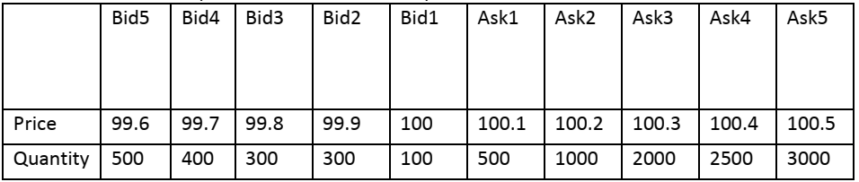

# MatchingEngine

**Problem**

You are required to implement a matching engine as part of the exchange simulator in a back testing platform.

**Background**

Order matching engines are one of the core components in modern exchanges. This component accepts buy and sell orders
from clients and matches them up according to various algorithms. One algorithm adopted by most exchanges is price/time
priority, which means orders with better price would get matched first and orders at the same price are matched
according to the sequence they enter the matching engine.

**Requirements**

The matching engine will accept a stream of market data to simulate the market order book. Each update will be a 5-level
snapshot as shown below:

**Implementation**

# Matching Engine

This is a single stock matching engine, implementing price/time priority matching algorithm.

### Classes:

- Order:
  Represents an order object. Has properties : id, price, quantity, buy or sell

- Amend:
  Represents order amend; 2 amends supported: Price & Quantity. Has properties order id, amendType, price (for price
  amend), quantity (for quantity amend)

- OrderBook (interface):
  Contract of methods providing basic functionality for an order book: InsertOrder; Amend order; Cancel order

-